---
## Front matter
lang: ru-RU
title: Лабораторная работа №4.
subtitle: 
author:
  - Карапетян Мари Рафаеловна
institute:
  - Российский университет дружбы народов, Москва, Россия
date: 22 февраля 2024

## Formatting
mainfont: PT Serif
romanfont: PT Serif
sansfont: PT Sans
monofont: PT Mono
toc: false
slide_level: 2
theme: metropolis
header-includes:
- \metroset{progressbar=frametitle,sectionpage=progressbar, numbering=fraction}
- '\makeatletter'
- '\beamer@ignorenonframefalse'
- '\makeatother'
aspectratio: 43
section-titles: true

---

# Цели и задачи работы

## Цели и задачи

Приобретение практических навыков взаимодействия пользователя с системой по-
средством командной строки

# Процесс выполнения лабораторной работы

## Определим полное имя вашего домашнего каталога.

{#fig:001 width=70%}

## Перейдём в каталог /tmp

{#fig:002 width=70%}

## Выведем на экран содержимое каталога /tmp с помощью команды ls

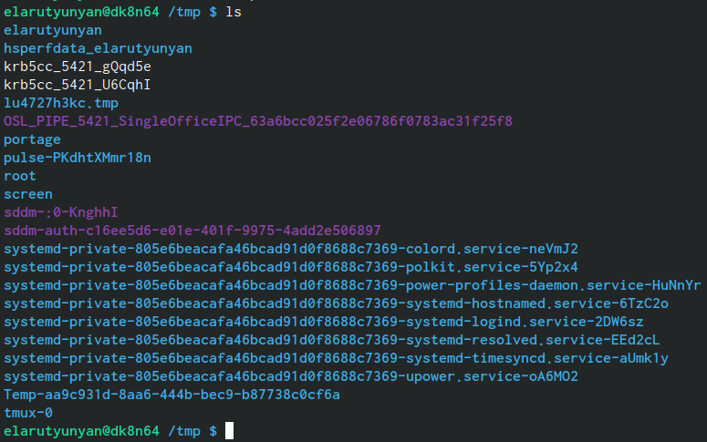{#fig:003 width=70%}

## Сравним команды ls -a и ls -F

{#fig:004 width=70%}
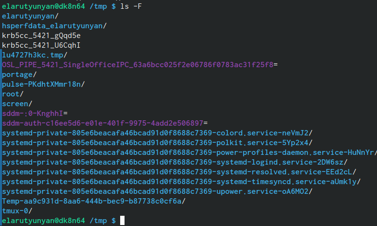{#fig:005 width=70%}
## Определим, есть ли в каталоге /var/spool подкаталог с именем cron

{#fig:006 width=70%}

## Переходим в домашний каталог

{#fig:007 width=70%}

## Определим, кто является владельцем файлов и подкаталогов с помоью команды ls -l

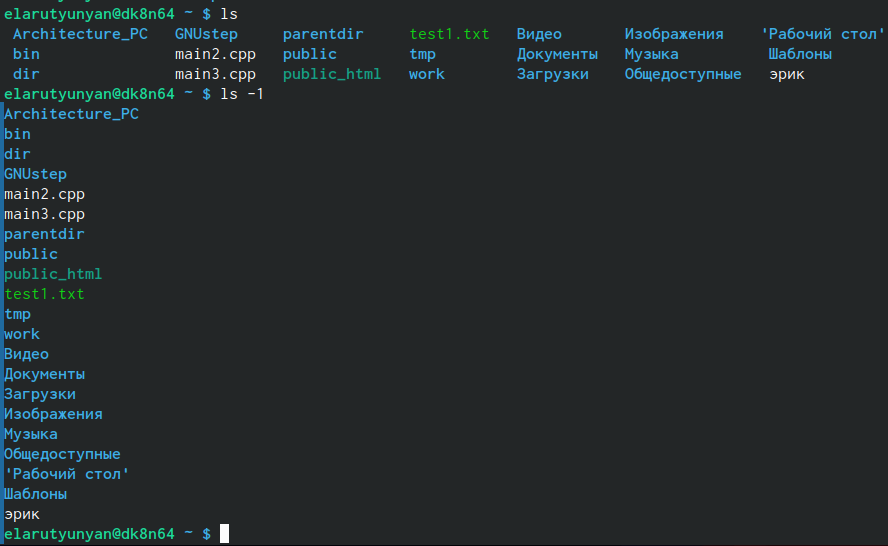{#fig:008 width=70%}

## В домашнем каталоге создаём новый каталог с именем newdir.

{#fig:009 width=70%}

## В каталоге ~/newdir создаём новый каталог с именем morefun.

{#fig:010 width=70%}

## Cоздаём одной командой три новых каталога с именами

{#fig:011 width=70%}

##

{#fig:012 width=70%}

##

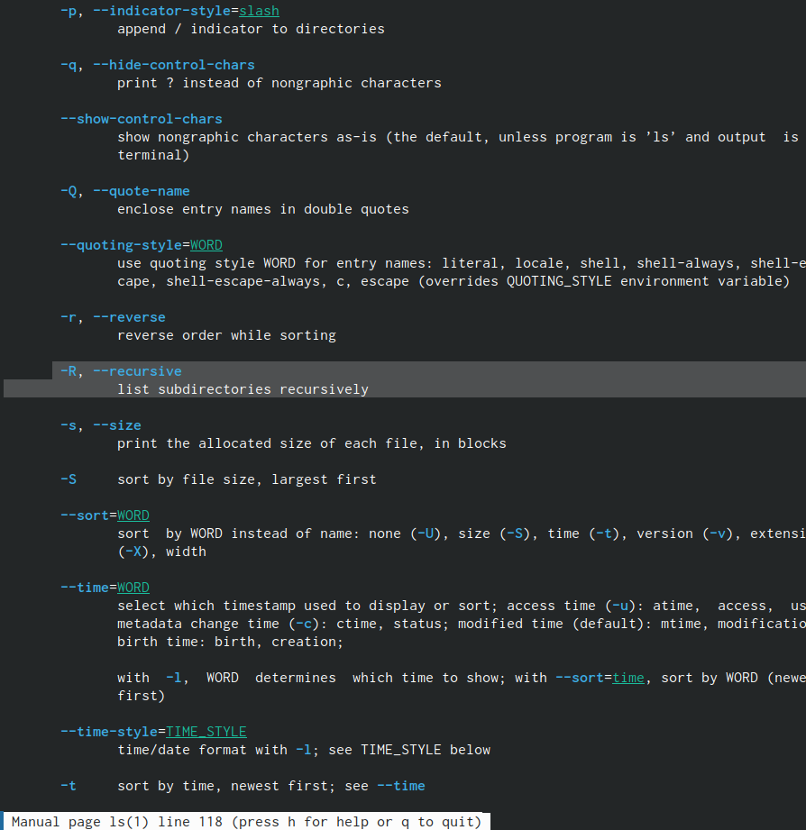{#fig:013 width=70%}

##

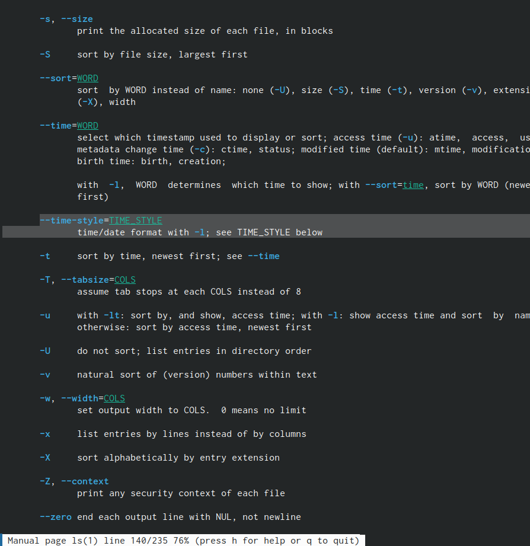{#fig:014 width=70%}

##

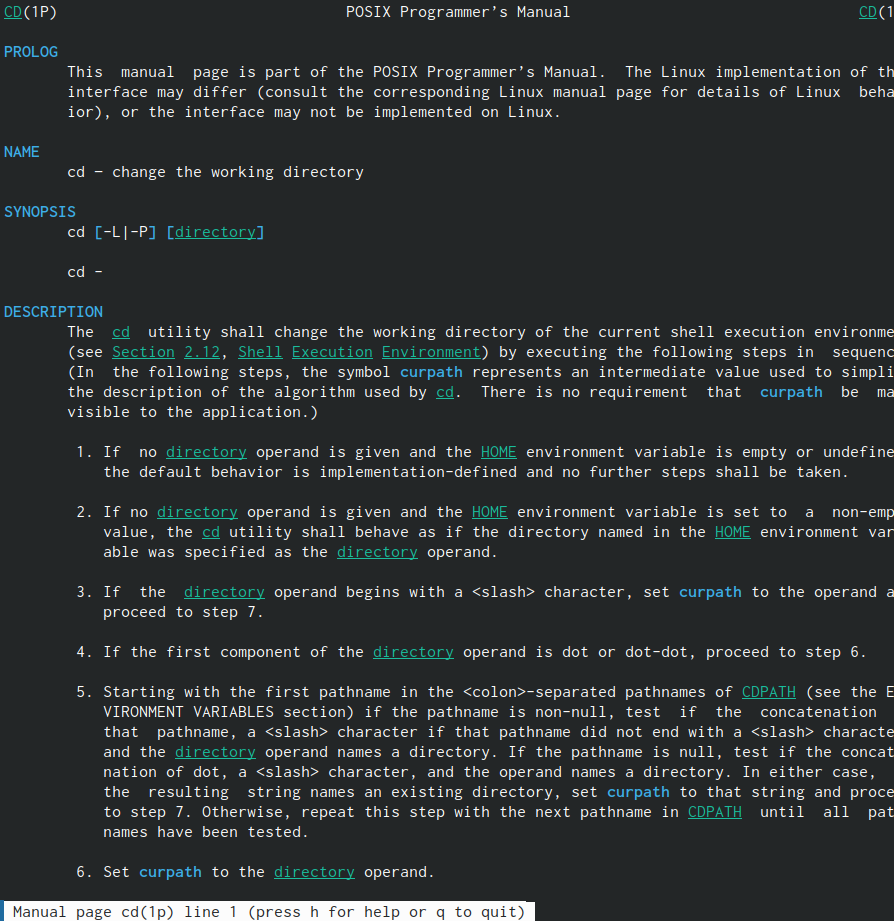{#fig:015 width=70%}

##

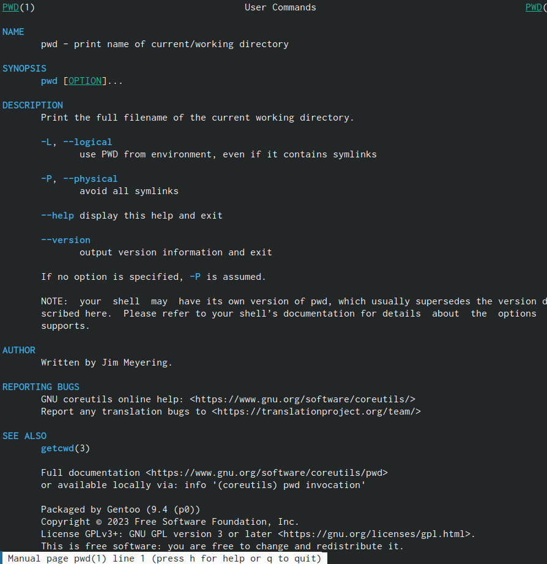{#fig:016 width=70%}

##

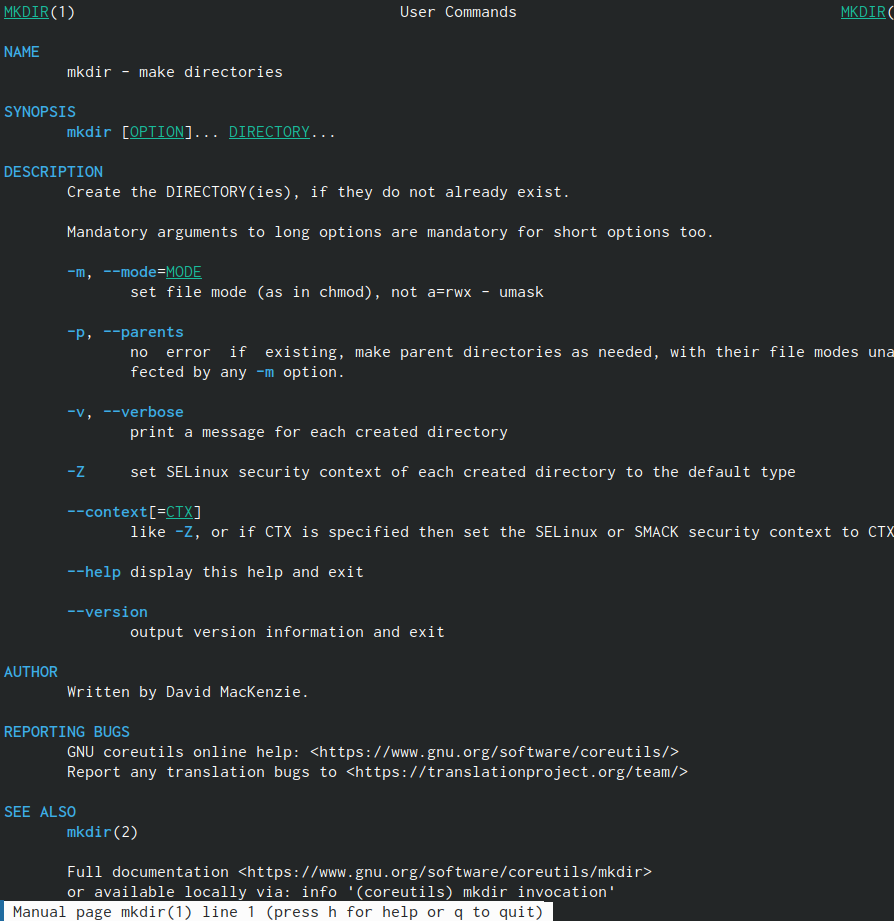{#fig:017 width=70%}

##

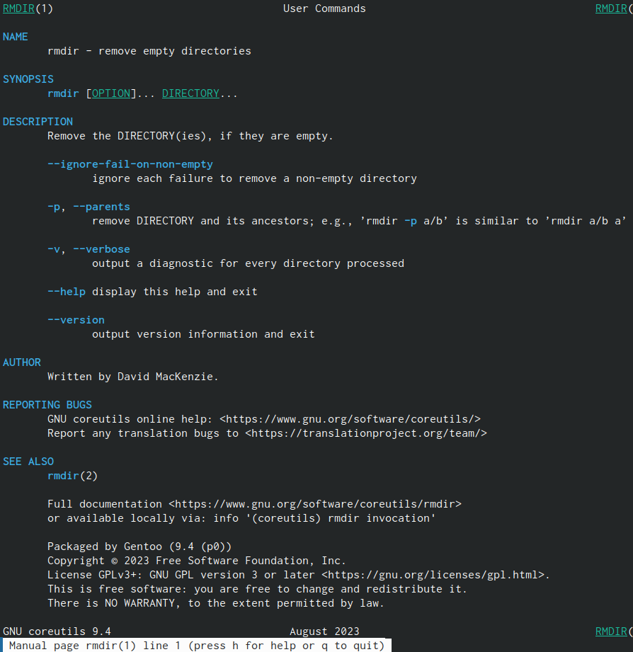{#fig:018 width=70%}

##

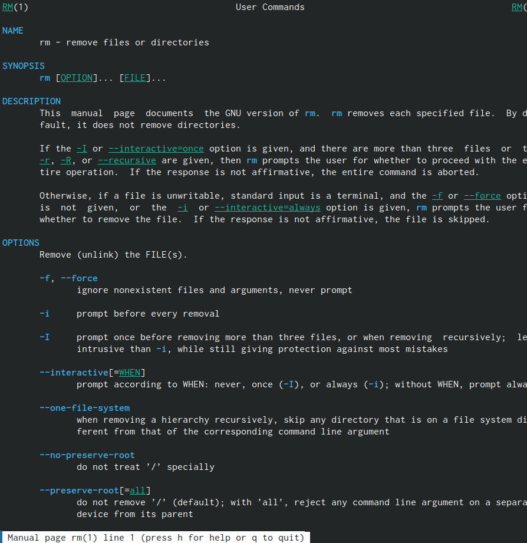{#fig:019 width=70%}

## Получим при помощи команды history

{#fig:020 width=70%}
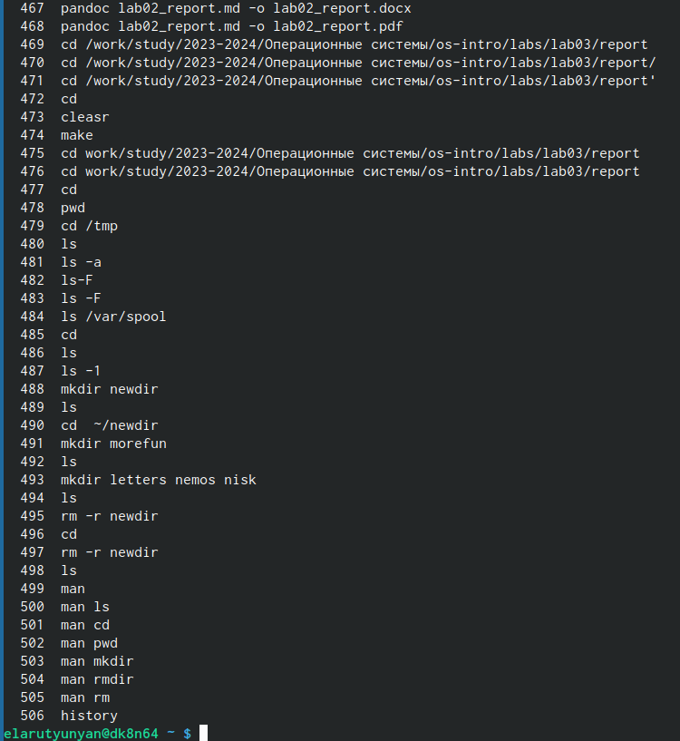{#fig:021 width=70%}

## Выполним модификацию и исполнение нескольких команд из буфера команд

{#fig:022 width=70%}
{#fig:023 width=70%}

## Выводы

Мы приобрели практические навыки взаимодействия пользователя с системой по-
средством командной строки.

