---
## Front matter
lang: ru-RU
title: Лабораторная работа №9.
subtitle: 
author:
  - Арутюнян Эрик Левонович
institute:
  - Российский университет дружбы народов, Москва, Россия
date: 3 апреля 2024

## Formatting
mainfont: PT Serif
romanfont: PT Serif
sansfont: PT Sans
monofont: PT Mono
toc: false
slide_level: 2
theme: metropolis
header-includes:
- \metroset{progressbar=frametitle,sectionpage=progressbar, numbering=fraction}
- '\makeatletter'
- '\beamer@ignorenonframefalse'
- '\makeatother'
aspectratio: 43
section-titles: true

---

# Цели и задачи работы

## Цели и задачи

Освоение основных возможностей командной оболочки Midnight Commander. Приоб-
ретение навыков практической работы по просмотру каталогов и файлов; манипуляций
с ними.

# Процесс выполнения лабораторной работы

## Информация о mc

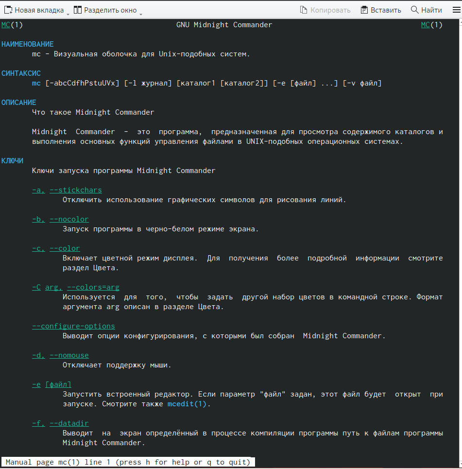{ #fig:001 width=70% }

## Изучение левой панели mc

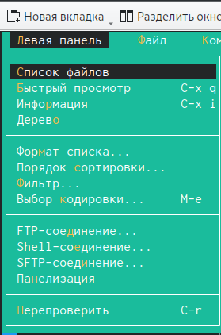{ #fig:002 width=50% }

## Изучение правой панели mc

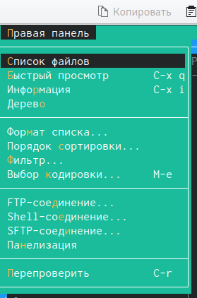{ #fig:003 width=50% }

## Выбор файла для просмотра 

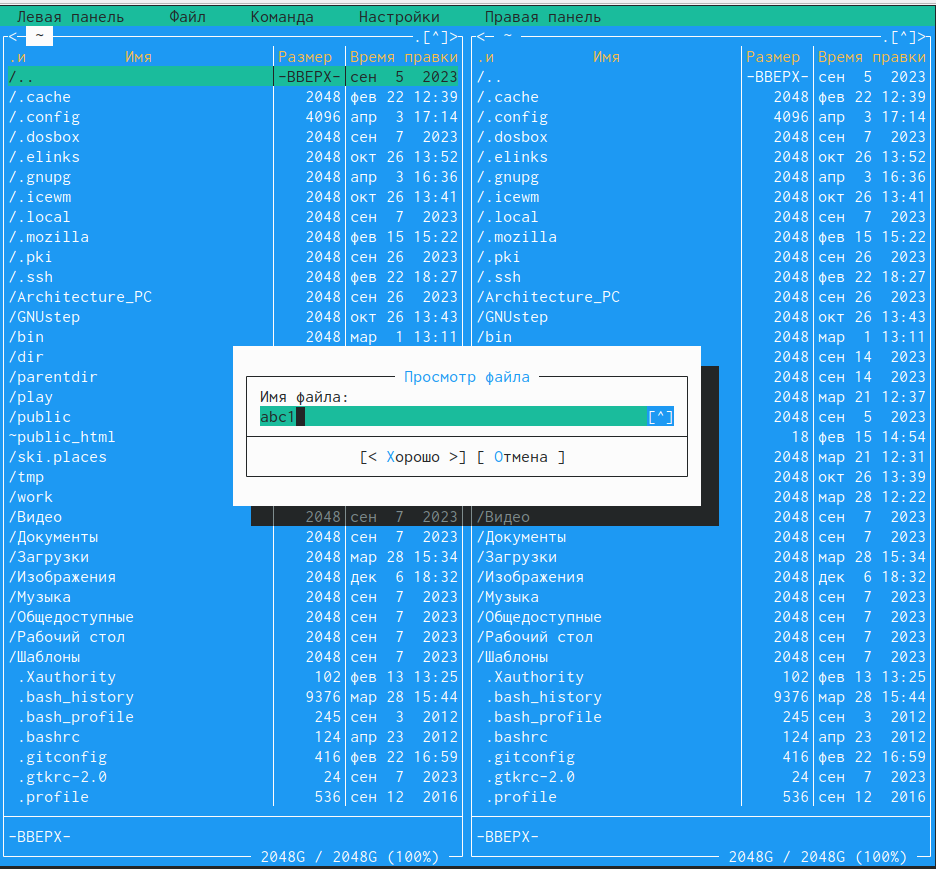{ #fig:004 width=70% }

## Содержимое файла

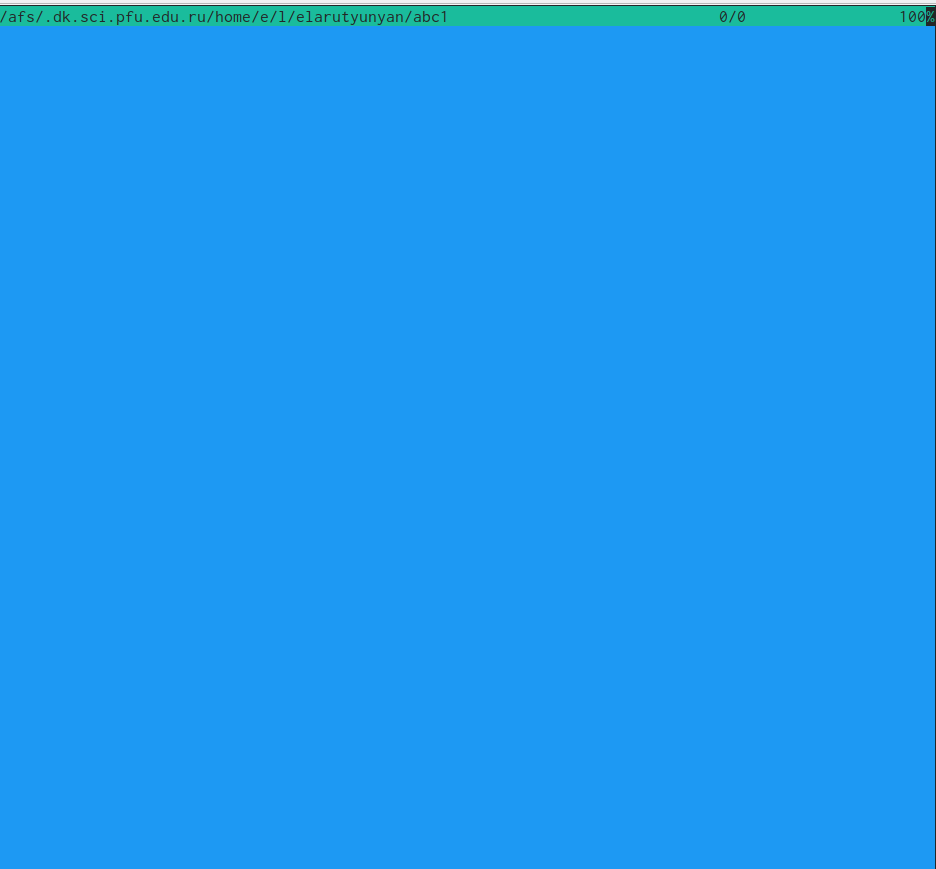{ #fig:005 width=70% }

## Функционал меню "Файл"

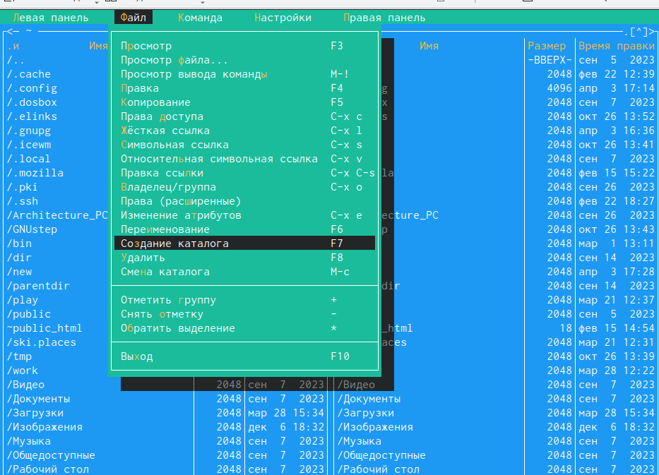{ #fig:006 width=70% }

## Создание нового каталога

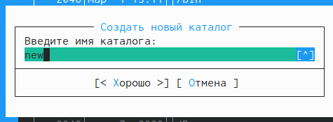{ #fig:007 width=100% }

## Проверка создания каталога
	
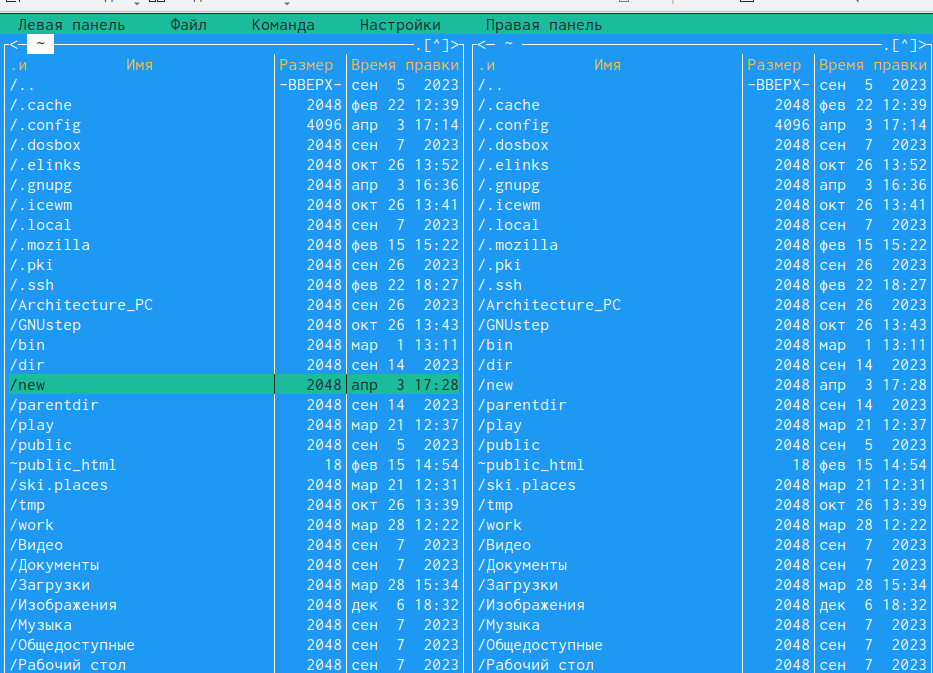{ #fig:008 width=100% }

## Копирование файла в каталог 

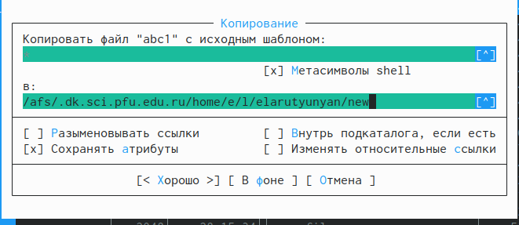{ #fig:009 width=100% }

## Проверка копирования

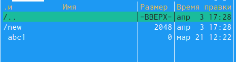{ #fig:010 width=100% }

## Поиск нужных файлов

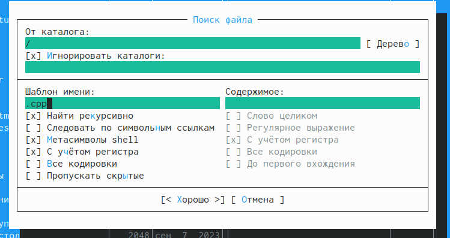{ #fig:011 width=100% }

## Результаты поиска
    	
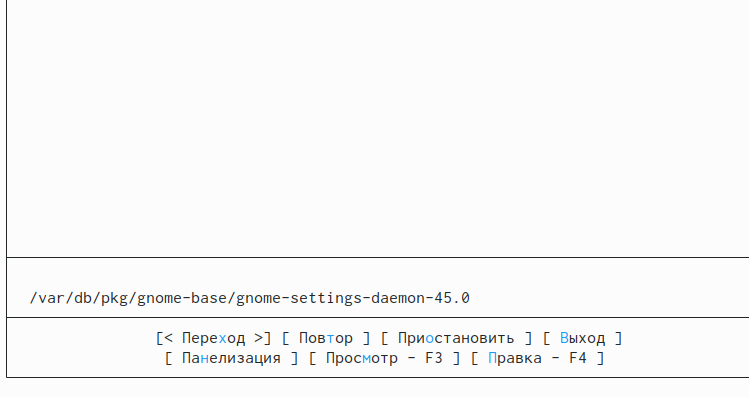{ #fig:012 width=100% }

## История команд

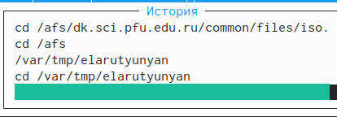{ #fig:013 width=100% }

## Домашний каталог

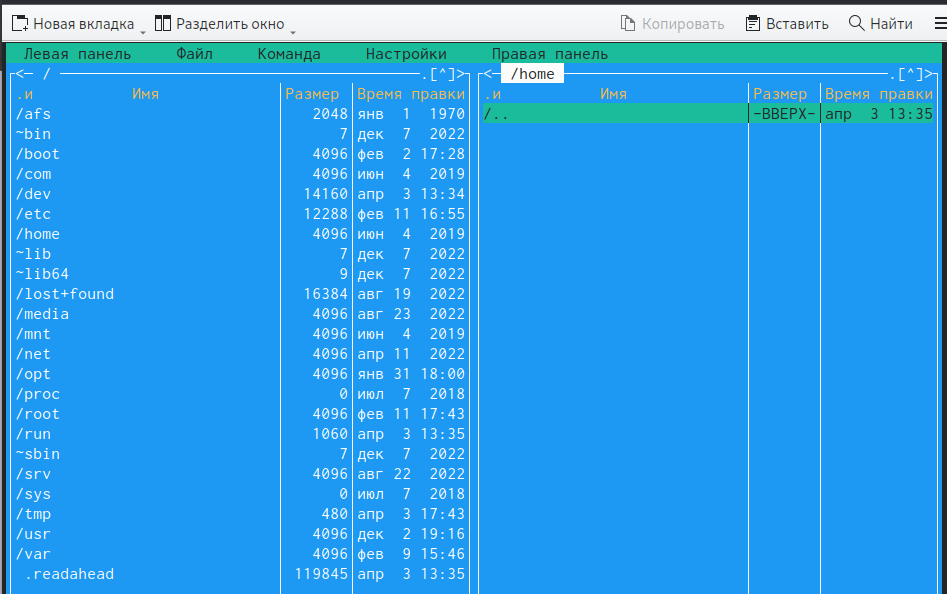{ #fig:014 width=100% }

## Анализ файла меню 

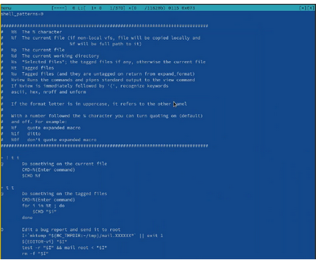{ #fig:015 width=70% }

## Анализ файла расширений

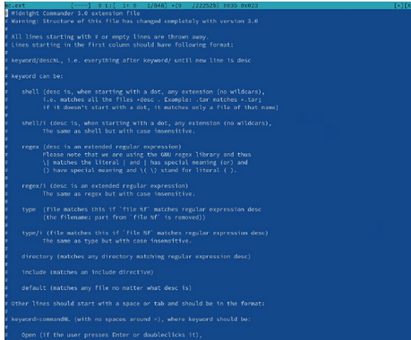{ #fig:016 width=70% }

## Подменю "Настройки"

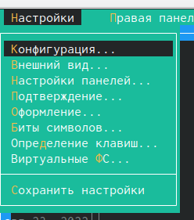{ #fig:017 width=70% }

## Работа с текстовым файлом

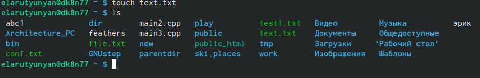{ #fig:018 width=100% }

## mcedit

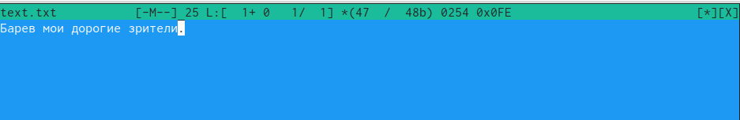{ #fig:019 width=70% }

## Выполнение всех клавиш

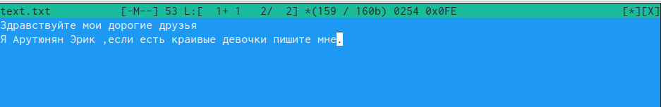{ #fig:020 width=100% }

## Создание файла с разрешением .cpp

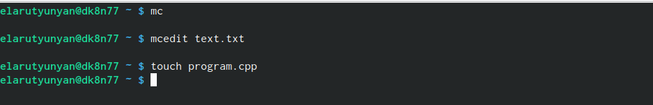{ #fig:021 width=100% }

## Выключение/включение подсветки синтаксиса

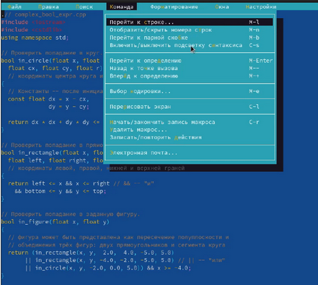{ #fig:022 width=70% }

## Выводы

В ходе выполнения лабораторной работы мы освоили основные возможности командной оболочки Midnight Commander. Приобрели навыки практической работы по просмотру каталогов и файлов, а также манипуляций с ними.
