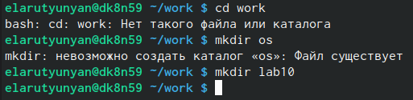
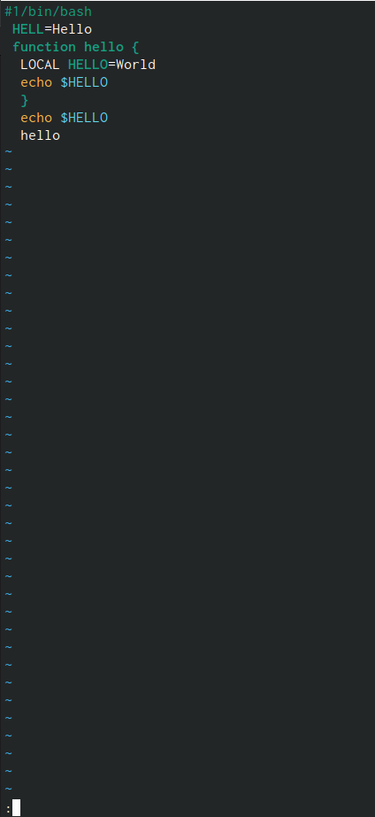
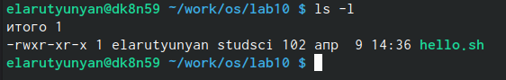
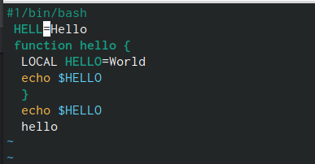
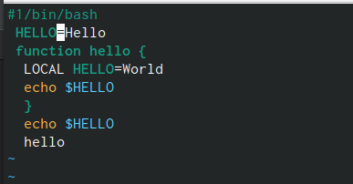
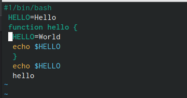
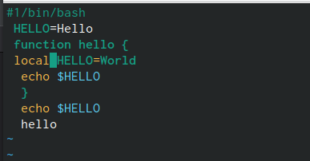
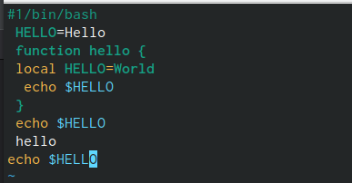
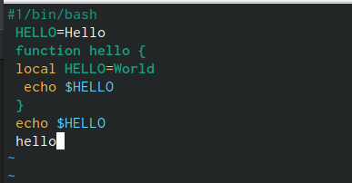

---
## Front matter
lang: ru-RU
title: Лабораторная работа №10.
subtitle: 
author:
  - Арутюнян Эрик Левонович
institute:
  - Российский университет дружбы народов, Москва, Россия
date: 10 апреля 2024

## Formatting
mainfont: PT Serif
romanfont: PT Serif
sansfont: PT Sans
monofont: PT Mono
toc: false
slide_level: 2
theme: metropolis
header-includes:
- \metroset{progressbar=frametitle,sectionpage=progressbar, numbering=fraction}
- '\makeatletter'
- '\beamer@ignorenonframefalse'
- '\makeatother'
aspectratio: 43
section-titles: true

---

# Цели и задачи работы

## Цели и задачи

Ознакомление с инструментами поиска файлов и фильтрации текстовых данных.
Приобретение практических навыков: по управлению процессами (и заданиями), по
проверке использования диска и обслуживанию файловых систем.

# Процесс выполнения лабораторной работы

## Создайте каталог с именем ~/work/os/lab08.

{#fig:001 width=70%}

## Перейдите во вновь созданный каталог.

{#fig:002 width=70%}

## Вызовите vi и создайте файл hello.sh

{#fig:003 width=70%}

{#fig:004 width=70%}

## Нажмите клавишу i и вводите следующий текст.

{#fig:005 width=70%}

## Нажмите : для перехода в режим последней строки и внизу вашего экрана появится приглашение в виде двоеточия

{#fig:006 width=70%}

## Нажмите w (записать) и q (выйти), а затем нажмите клавишу Enter для сохранения вашего текста и завершения работы.

{#fig:007 width=70%}

## Сделайте файл исполняемым

{#fig:008 width=70%}

## Установите курсор в конец слова HELL второй строки.

{#fig:009 width=70%}

## Перейдите в режим вставки и замените на HELLO. 

{#fig:010 width=70%}

## Установите курсор на четвертую строку и сотрите слово LOCAL.

{#fig:011 width=70%}

{#fig:012 width=70%}

## Перейдите в режим вставки и наберите следующий текст: local

{#fig:013 width=70%}

## Установите курсор на последней строке файла.

{#fig:014 width=70%}

{#fig:015 width=70%}

## Нажмите Esc для перехода в командный режим.

{#fig:016 width=70%}

## Удалите последнюю строку.

{#fig:017 width=70%}

## Отмена последней команды.

{#fig:018 width=70%}

## Запишите произведённые изменения и выйдите из vi.

{#fig:019 width=70%}

## Выводы

Мы приобрели практические навыки: по управлению процессами (и заданиями), по
проверке использования диска и обслуживанию файловых систем.
