---
## Front matter
title: "Лабораторная работа №11"
subtitle: "Поиск файлов. Перенаправление ввода-вывода. Просмотр запущенных процессов"
author: "Арутюнян Эрик Левонович"

## Generic otions
lang: ru-RU
toc-title: "Содержание"

## Bibliography
bibliography: bib/cite.bib
csl: pandoc/csl/gost-r-7-0-5-2008-numeric.csl

## Pdf output format
toc: true # Table of contents
toc-depth: 2
lof: true # List of figures
lot: true # List of tables
fontsize: 12pt
linestretch: 1.5
papersize: a4
documentclass: scrreprt
## I18n polyglossia
polyglossia-lang:
  name: russian
  options:
	- spelling=modern
	- babelshorthands=true
polyglossia-otherlangs:
  name: english
## I18n babel
babel-lang: russian
babel-otherlangs: english
## Fonts
mainfont: PT Serif
romanfont: PT Serif
sansfont: PT Sans
monofont: PT Mono
mainfontoptions: Ligatures=TeX
romanfontoptions: Ligatures=TeX
sansfontoptions: Ligatures=TeX,Scale=MatchLowercase
monofontoptions: Scale=MatchLowercase,Scale=0.9
## Biblatex
biblatex: true
biblio-style: "gost-numeric"
biblatexoptions:
  - parentracker=true
  - backend=biber
  - hyperref=auto
  - language=auto
  - autolang=other*
  - citestyle=gost-numeric
## Pandoc-crossref LaTeX customization
figureTitle: "Рис."
tableTitle: "Таблица"
listingTitle: "Листинг"
lofTitle: "Список иллюстраций"
lotTitle: "Список таблиц"
lolTitle: "Листинги"
## Misc options
indent: true
header-includes:
  - \usepackage{indentfirst}
  - \usepackage{float} # keep figures where there are in the text
  - \floatplacement{figure}{H} # keep figures where there are in the text
---

# Цель работы

Ознакомление с инструментами поиска файлов и фильтрации текстовых данных.
Приобретение практических навыков: по управлению процессами (и заданиями), по
проверке использования диска и обслуживанию файловых систем

# Выполнение лабораторной работы

1. Создайте каталог с именем ~/work/os/lab08.

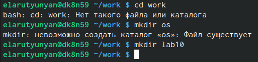{#fig:001 width=70%}

2. Перейдите во вновь созданный каталог.

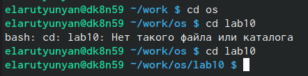{#fig:002 width=70%}

3. Вызовите vi и создайте файл hello.sh

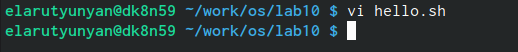{#fig:003 width=70%}

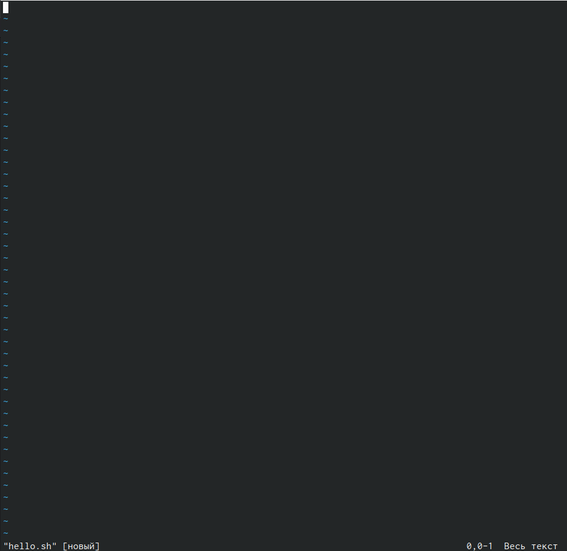{#fig:004 width=70%}

4. Нажмите клавишу i и вводите следующий текст.

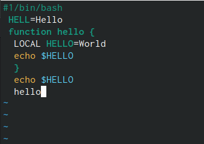{#fig:005 width=70%}

5. Нажмите клавишу Esc для перехода в командный режим после завершения ввода
текста.

6. Нажмите : для перехода в режим последней строки и внизу вашего экрана появится
приглашение в виде двоеточия

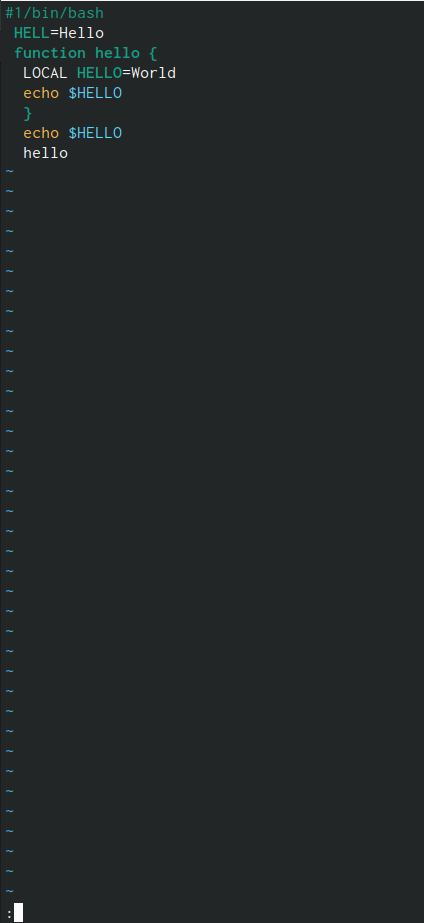{#fig:006 width=70%}

7. Нажмите w (записать) и q (выйти), а затем нажмите клавишу Enter для сохранения
вашего текста и завершения работы.

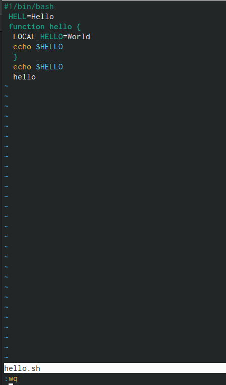{#fig:007 width=70%}

8. Сделайте файл исполняемым

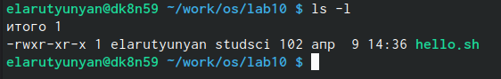{#fig:008 width=70%}

9. Редактирование существующего файла

10. Вызовите vi на редактирование файла

11. Установите курсор в конец слова HELL второй строки.

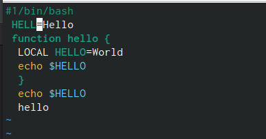{#fig:009 width=70%}

12. Перейдите в режим вставки и замените на HELLO. Нажмите Esc для возврата в команд-
ный режим.

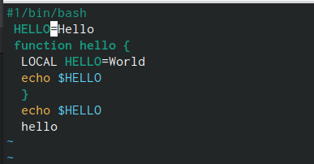{#fig:010 width=70%}

13. Установите курсор на четвертую строку и сотрите слово LOCAL.

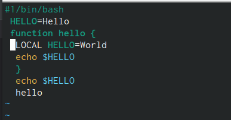{#fig:011 width=70%}

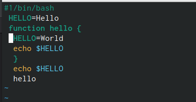{#fig:012 width=70%}

14. Перейдите в режим вставки и наберите следующий текст: local, нажмите Esc для
возврата в командный режим.

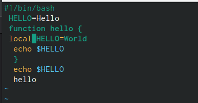{#fig:013 width=70%}

15. Установите курсор на последней строке файла. Вставьте после неё строку, содержащую
следующий текст: echo $HELLO.

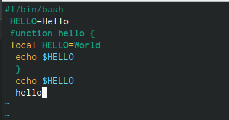{#fig:014 width=70%}

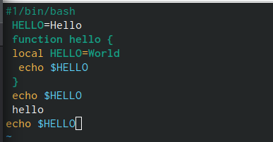{#fig:015 width=70%}

16. Нажмите Esc для перехода в командный режим.

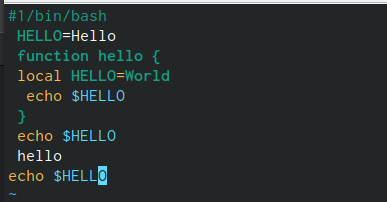{#fig:016 width=70%}

17. Удалите последнюю строку.

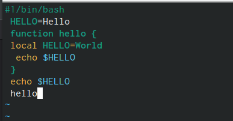{#fig:017 width=70%}

18. Введите команду отмены изменений u для отмены последней команды.

{#fig:018 width=70%}

19. Введите символ : для перехода в режим последней строки. Запишите произведённые
изменения и выйдите из vi.

{#fig:019 width=70%}

# Выводы

Мы приобрели практические навыки: по управлению процессами (и заданиями), по
проверке использования диска и обслуживанию файловых систем.
