---
## Front matter
lang: ru-RU
title: Лабораторная работа №13.
subtitle: 
author:
  - Арутюнян Эрик Левонович
institute:
  - Российский университет дружбы народов, Москва, Россия
date: 2 мая 2024

## Formatting
mainfont: PT Serif
romanfont: PT Serif
sansfont: PT Sans
monofont: PT Mono
toc: false
slide_level: 2
theme: metropolis
header-includes:
- \metroset{progressbar=frametitle,sectionpage=progressbar, numbering=fraction}
- '\makeatletter'
- '\beamer@ignorenonframefalse'
- '\makeatother'
aspectratio: 43
section-titles: true

---

# Цели и задачи работы

## Цели и задачи

Ознакомление с инструментами поиска файлов и фильтрации текстовых данных.
Приобретение практических навыков: по управлению процессами (и заданиями), по
проверке использования диска и обслуживанию файловых систем.

# Процесс выполнения лабораторной работы

## Запишем в файл file.txt названия файлов

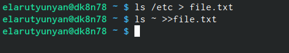{#fig:001 width=70%}

## Выведем имена всех файлов из file.txt

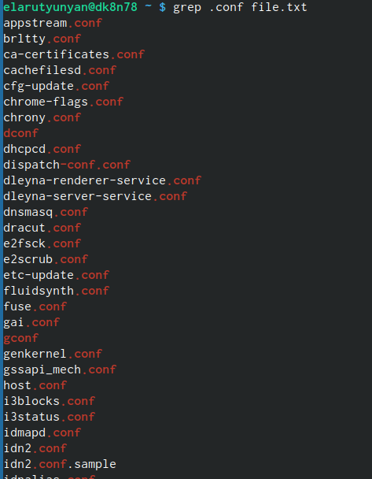{#fig:002 width=70%}

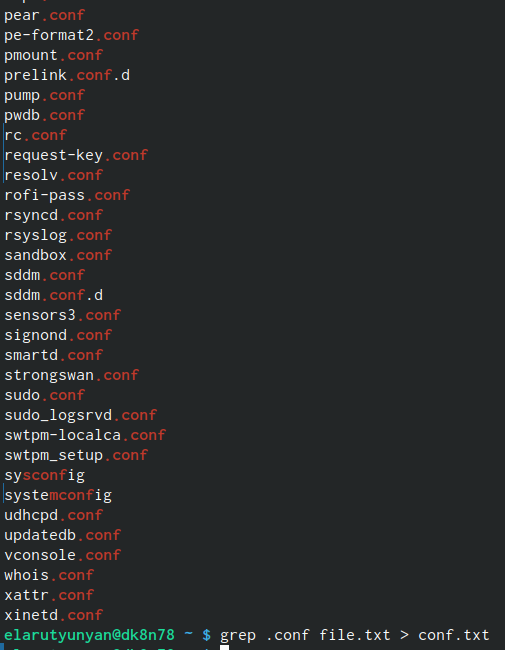{#fig:003 width=70%}

## Определим какие файлы в домашнем каталоге начинаются с символа с. 
    
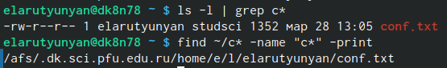{#fig:004 width=70%}

## Выведем на экран имена файлов из каталога /etc, начинающиеся с символа h

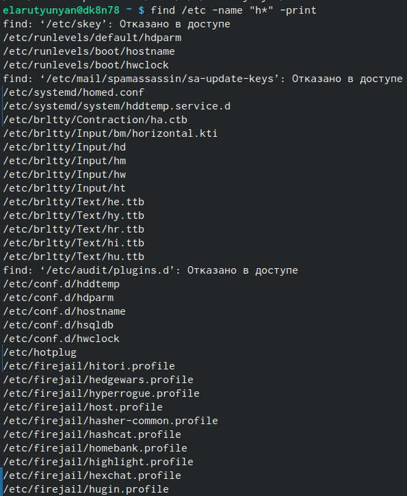{#fig:005 width=70%}

## Запустим в фоновом режиме процесс, который будет записывать в файл ~/logfile файлы, имена который начинаются с log, удалим logfile.

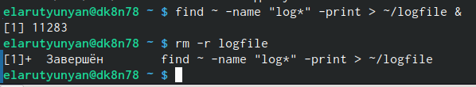{#fig:006 width=70%}

## Запустим из консоли в фоновом редиме gedit.
 
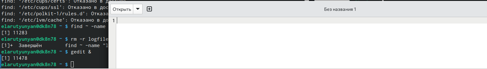{#fig:007 width=70%}

## Определим индефикатор процесса с помощью команды ps 

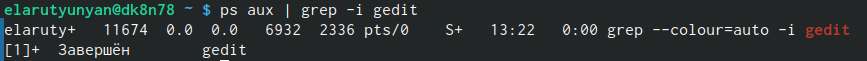{#fig:008 width=70%}

## Изучим команду kill и с помощью неё прекратим gedit

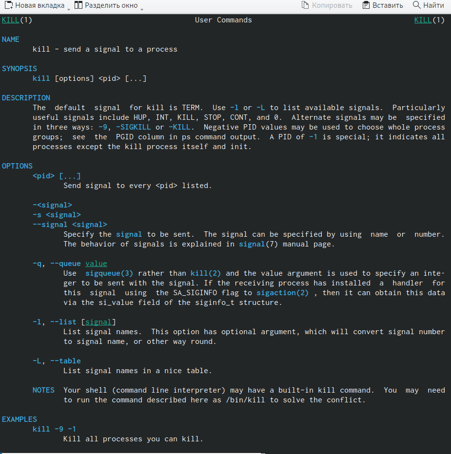{#fig:009 width=70%}

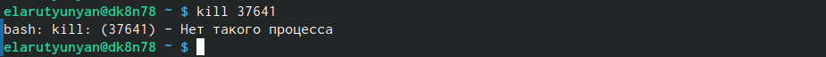{#fig:010 width=70%}

## Изучим и выполним команды df и du

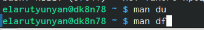{#fig:011 width=70%}

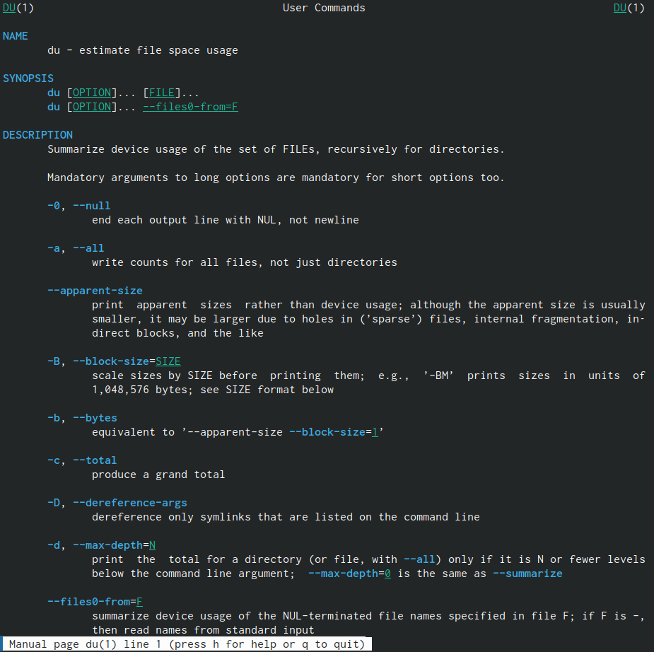{#fig:012 width=70%}

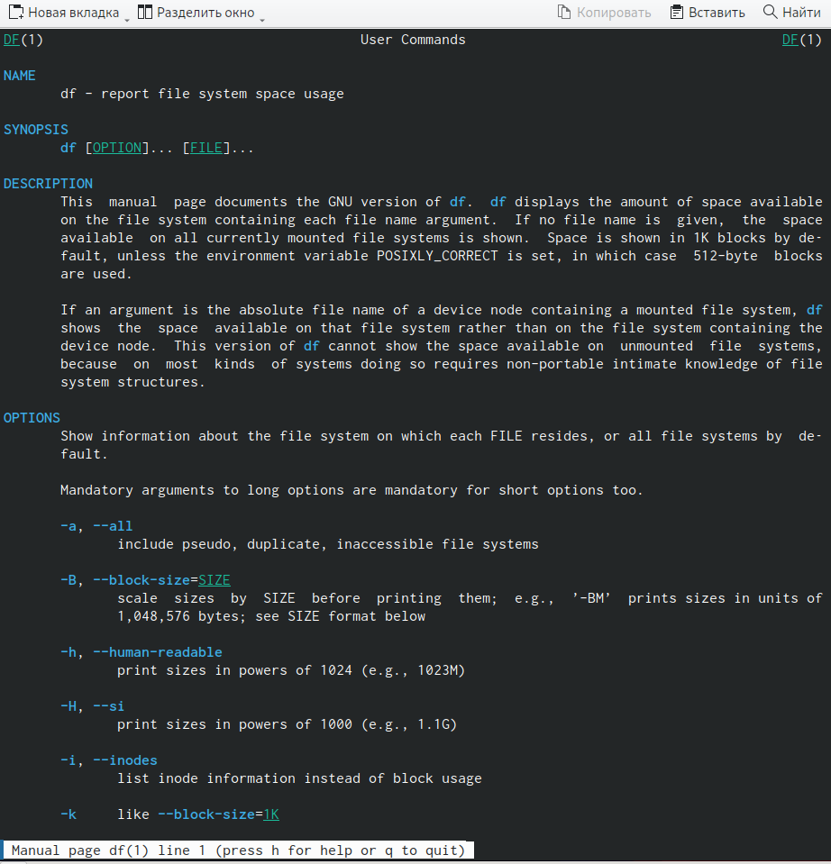{#fig:013 width=70%}

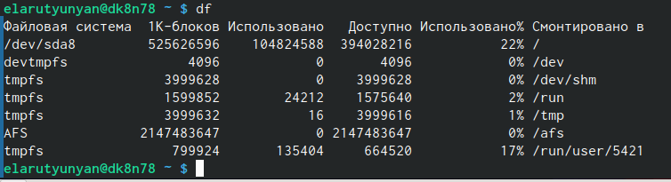{#fig:014 width=70%}

## С помощью команды find выведем именя всех директорий 

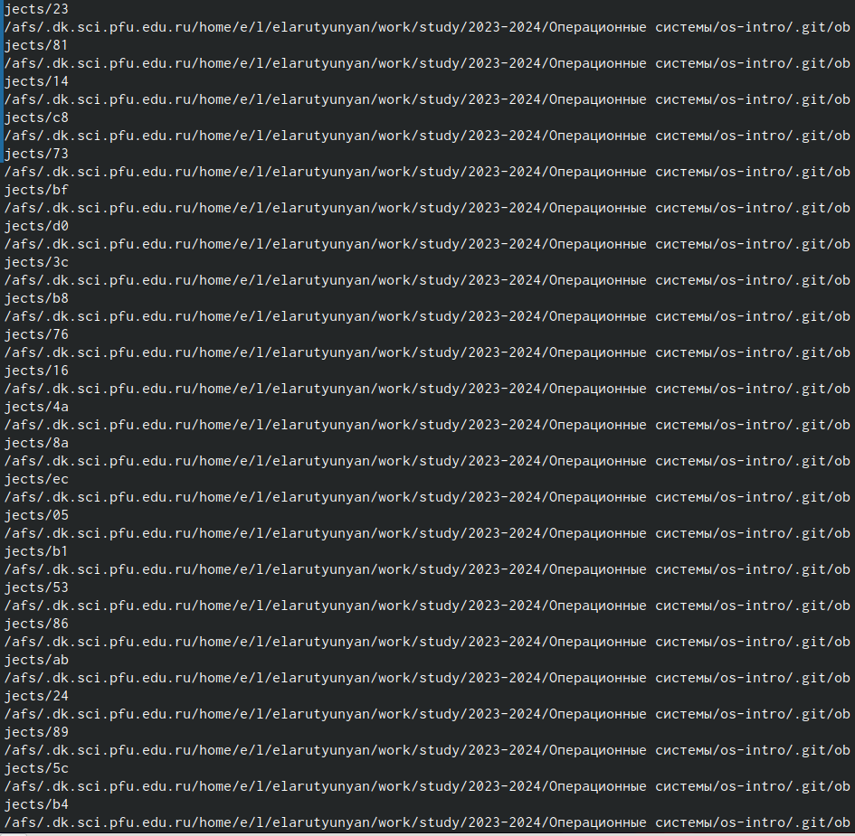{#fig:015 width=70%}

## Выводы

Мы ознакомились с инструментами поиска файлов и фильтрации текстовых данных. Приобрели практические навыки: по управлению процессами (и заданиями), по проверке использования диска и обслуживанию файловых систем.

