---
## Front matter
lang: ru-RU
title: "Отчет о выполнении индивидуального проекта.Этап 3."
subtitle: 
author:
  - Арутюнян Эрик Левонович
institute:
  - Российский университет дружбы народов, Москва, Россия
date: 4 апреля 2024

## Formatting
mainfont: PT Serif
romanfont: PT Serif
sansfont: PT Sans
monofont: PT Mono
toc: false
slide_level: 2
theme: metropolis
header-includes:
- \metroset{progressbar=frametitle,sectionpage=progressbar, numbering=fraction}
- '\makeatletter'
- '\beamer@ignorenonframefalse'
- '\makeatother'
aspectratio: 43
section-titles: true

---

# Цели и задачи работы

## Цели и задачи

Добавить к сайту достижения.
Список достижений.
Добавить информацию о навыках (Skills).
Добавить информацию об опыте (Experience).
Добавить информацию о достижениях (Accomplishments).
Сделать пост по прошедшей неделе.
Добавить пост на тему по выбору:
Легковесные языки разметки.
Языки разметки. LaTeX.
Язык разметки Markdown.

# Процесс выполнения индивидуального проекта

## Добавление навыков на сайт

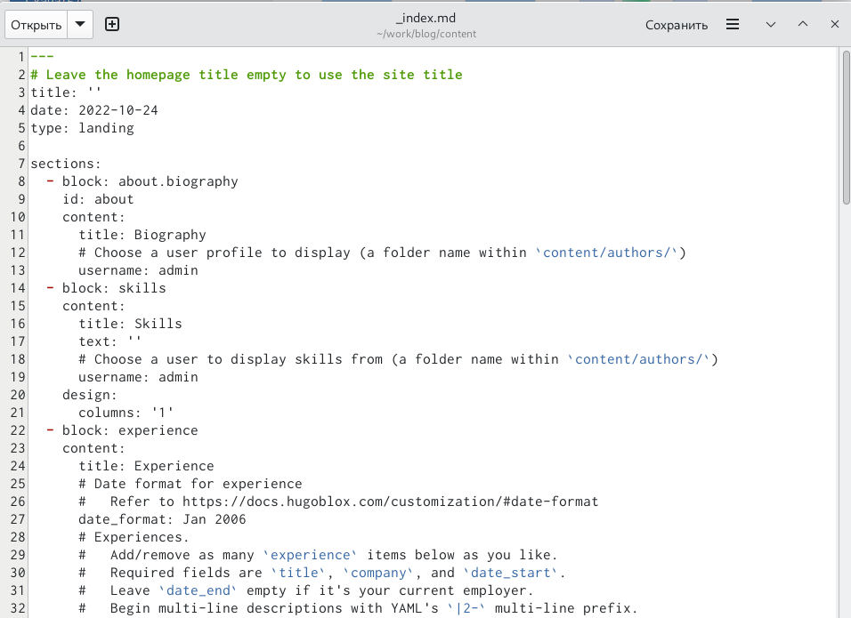{ #fig:001 width=80% }

## Добавление опыта на сайт

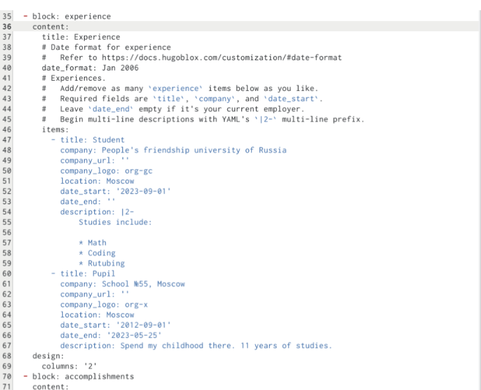{ #fig:002 width=80% }

## Добавление достижений на сайт

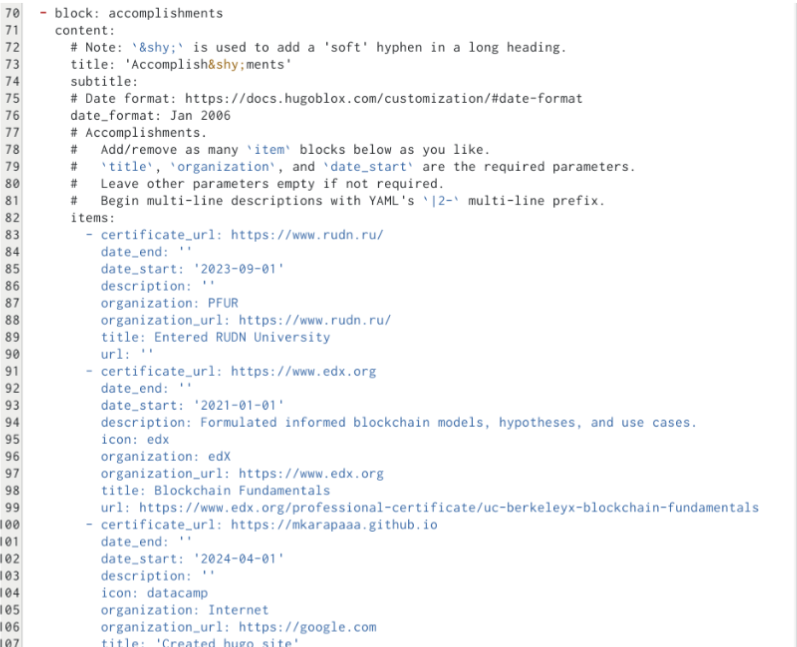{ #fig:003 width=100% }

## Создание постов

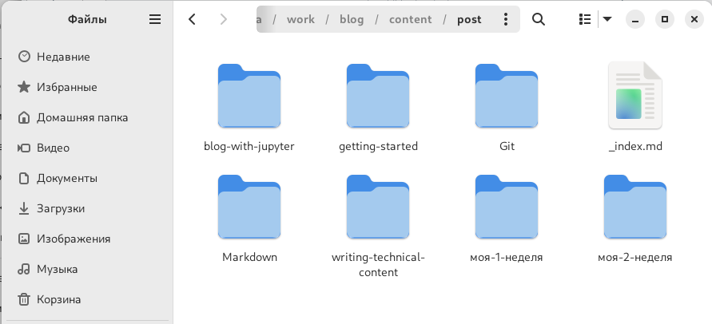{ #fig:004 width=100% }

## hugo

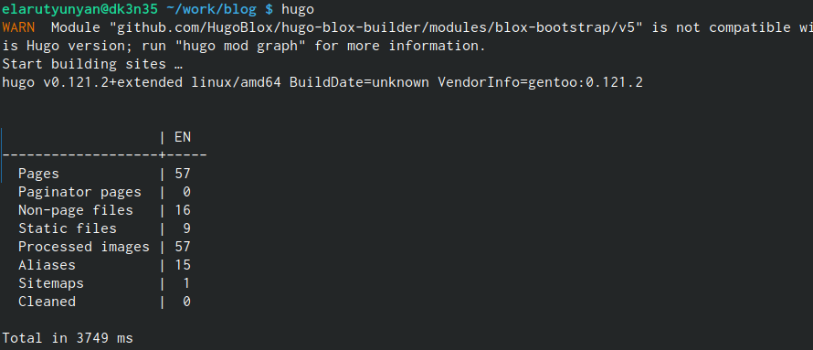{ #fig:005 width=100% }

## Выгрузка из подкаталога "public"

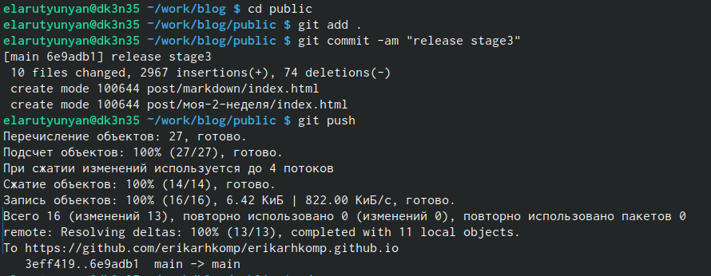{ #fig:006 width=80% }

## Выгрузка из каталога "blog"

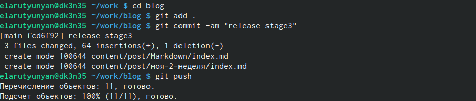{ #fig:007 width=80% }

## Внешний вид обновлённого сайта

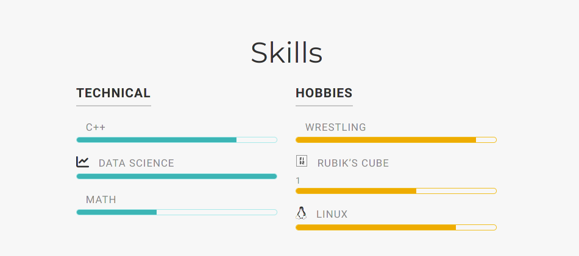{ #fig:008 width=100% }

## Внешний вид обновлённого сайта

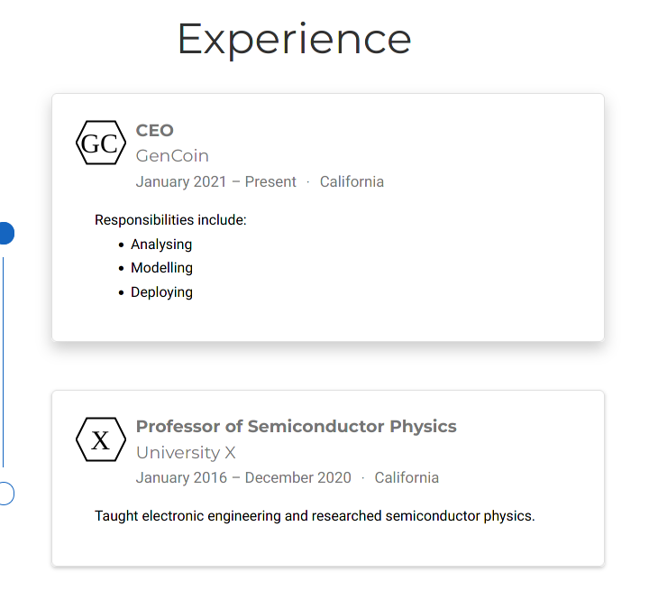{ #fig:009 width=100% }

## Внешний вид обновлённого сайта

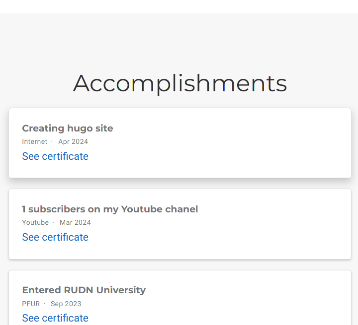{ #fig:010 width=100% }

## Внешний вид обновлённого сайта

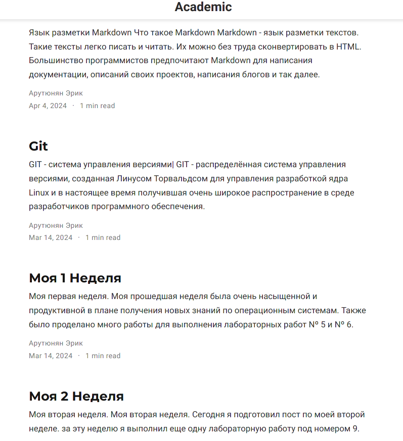{ #fig:011 width=100% }

# Выводы

В ходе выполнения третьего этапа индивидуального проекта мы научилис
